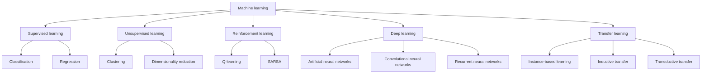

---

"Machine Learning" do Mitchell

"Pattern Recognition and Machine Learning" do Bishop

Esqueci me de dizer que em termos de cursos online, tens o clássico do Andrew Ng (no coursera?). Fiz já há um tempo e é uma boa introdução. Sei que agora tem uma nova roupagem,  mas não sei como está.

De resto fica um bocado ao gosto da pessoa e do que quer aprender. O mesmo para os livros. Também depende do teu nível e da profundidade (cof perceber com as bases matemáticas cof) com que queiras aprender.

Até agora foram te sugeridos 2 livros super teóricos. Acho q estas a procura de algo mais pratico.
Algo como:
Hands on Machine learning with scikit-learn, keras, and tensor flow 2nd edition 2019
